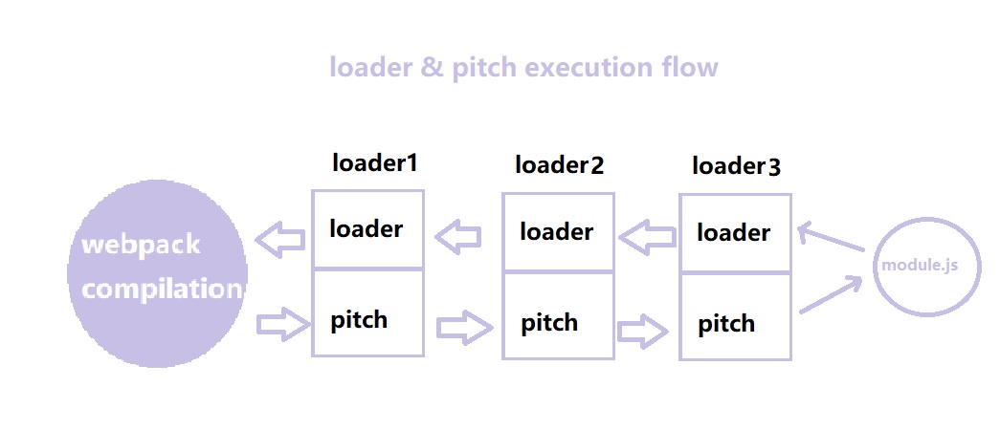

# Webpack Loader

## Content

* What
* Why & Where
* work flow

### What is Loader

loader 就是一个个的加载器，主要功能是协助 Webpack 在解析模块资源时，将原有的不同模块通过相应的预处理器转译成 JS 模块。

### Why & Where

Webpack 默认情况只能识别 JS 模块，在分析资源依赖关系时，碰到非 JS 模块时，就需要通过相应的 loader 来加载处理内容。

### work flow

Loader 的运行流程如下：

* Compiler.js （一整个 Webpack）合并用户配置和默认配置，包括 module.rules[index]loader 部分;
* compiler 调用 `compile` 方法开始本次编译，内部首先调用 `newCompilationParams`，创建一个 `NormalModuleFactory`，它用来创建 NormalModule
* 普通模块工厂创建 NormalModule 之前，通过 loader 的 resolver 来解析 loader 路径
* 普通模块工厂创建 NormalModule 之后，包含了 _resource 和 _ast 等属性，执行其 build 方法构建模块加载原来的模块内容
* loader-runner 是 webpack 中 loader 的运行期，一个模块可能有多个 loader
* 最后，将 loader 处理完的模块内容输出，进入后续的编译流程。


## Customized Loader

### Content

* 使用自定义 loader 引用方式
* babel-loader 实现
* file-loader 实现
* url-loader 实现
* 总结

自定义 Loader 的编写通过 Node.js 实现，遵循 commomjs 规范。
官方定义 loader 会导出一个 loader 函数，上面还可挂载多个属性。

### 使用自定义 loader 引用方式

* resolveLoader
    * alias: 'loader-name': path.resolve(__dirname, 'loaders/loader.name.js')
    * modules: [ path.resolve(__dirname, 'loaders'), 'node_modules' ]
* resolve 同上
    * alias
    * modules
* npm link 建立当前 loader 库包的软连接


### babel-loader 实现

需要依赖 @babel/preset-env 和 @babel/core 两个库来实现 ES6/7/... 向低版本 ES 语法的转换。

[参考](https://babeljs.io/docs/en/configuration#using-the-api-babel-core)

执行 require('@babel/core').transform 核心方法，传入 options 即可。

```js
const babel = require('@babel/core');

function loader(source, inputSourceMap, ast) {
    const options = {
        presets: ['@babel/preset-env'],
        inputSourceMap,
        sourceMaps: true,
        filename: this.request.split('!').pop().split('/').pop(),
    };
    const {code, map, ast} = babel.transform(source, options);
    return code;
}

module.exports = loader;
```

### file-loader 实现

需求：

* file-loader 处理图片模块，当依赖文件正则匹配为图片时，用 file-loader 进行加载处理
* 默认不会转换文件内容，只会复制文件内容，根据配置生成一个唯一的文件名
* NormalModule 默认是以 utf-8 读取文件，需手动设置 `loader.raw` 为 true，即为二进制格式文本 source
* 产出文件，执行 this.emitFile(url, source)
* 结合 loader-utils 提供的 getOptions 和 interpolateName 获取用户 options, 以及解析需要产出的 url 路径
    * getOptions: (loaderContext: webpack.loader.LoaderContext) => Readonly<OptionObject>
    * interpolateName: (loaderContext: webpack.loader.LoaderContext, name: string, options?: any) => string

实现
```js
const { getOptions, interpolateName } = require('loader-utils');

function loader(source, inputSourceMap, ast) {
    console.log(source, 'source');
    const options = getOptions(this) || {};
    const url = interpolateName(this, options.filename || '[hash].[ext]', {
        content: source,
    });
    console.log(`url: `, url);
    console.log(`options: `, options);
    this.emitFile(url, source);
    return `module.exports = ${JSON.stringify(url)}`;
}

// 以 二进制格式 读取源文件
loader.raw = true;

module.exports = loader;
```

### url -loader 实现

在 style-loader 基础上，将较小文件转为 base64 字符串格式，不进行文件产出

options:
* limit: 文件大小限制，大于 limit, 就把文本交由 file-loader 解析处理
* filename: 文件名，可以包含要书出的目录，如：'images/[hash].[ext]'

实现：
```js
const { getOptions, interpolateName } = require('loader-utils');
const mime = require('mime');
const path = require('path');
const resolve = (...args) => path.resolve(__dirname, ...args);

function loader(source) {
    let { limit, fallback = 'file-loader' } = getOptions(this) || {}
    if (limit) limit = parseInt(limit, 10);// 十进制转任意进制（默认十进制）
    const mimeType = mime.getType(this.resourcePath);
    if (!limit || source.length < limit) {
        const base64 = `data:${mimeType};base64,${source.toString('base64')}`;
        return `module.exports = ${JSON.stringify(base64)}`;
    } else {
        // 实际线上开发，直接用r require(fallback) 即可
        let fileLoader = require(resolve(fallback));
        return fileLoader.call(this, source);
    }
}

loader.raw = true;

module.exports = loader;
```

### 总结

loader 函数也是一个对象，loader-runner 调用，执行上下文 this 指向 loaderContext

loaderContext 上有一系列属性:

* `emitFile` 产出文件函数
* `request` /loaders/babel-loader.js **!**/src/index.js 
* `userRequest` /src/index.js
* `rawRequest` ./src/index.js
* `resourcePath` /src/index.js

执行顺序：
* loader： 总右往左，如：a-loader!b-loader!c-loader!module，执行顺序就是 module 传给 c->b->a
* pitch：总左往右，如：a-loader!b-loader!c-loader, 执行循序就是 a.pitch -> b.pitch -> c.pitch-> c-> b-> a
* 注意：其中一个 pitch 返回结果，就认为后面的 loader 已执行完毕，如 b.pitch 返回了结果，b 和 c 的loader 直接跳过，将这个结果传给 a.loader 执行处理

```js
|- a-loader `pitch`
  |- b-loader `pitch`
    |- c-loader `pitch`
      |- requested module is picked up as a dependency
    |- c-loader normal execution
  |- b-loader normal execution
|- a-loader normal execution
```




pitch 方法：
```js
/**
 * loader 可以提供的 pitch 方法
 * @param {string} remainingRequest 剩余的 request 路径，原始（a!b!module）
 * @param {string} previousRequest 上一次处理的 loader 路径
 * @param {any} data 
 */
loader.pitch(remainingRequest, previousRequest, data) {

}
```

## Fulfill Loader-runner

